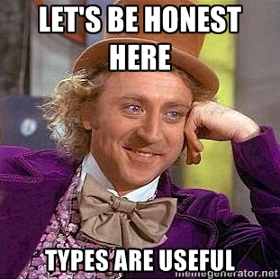

# Spec



## Introduction

In dynamic functional languages such as Clojure, we are generally concerned
with what things **do** in a very generic sense. In typed functional languages
such as Haskell or PureScript, on the other hand, we are more concerned with
precisely what things **are**.

Although Clojure is a dynamically-typed language, a notion of what things are
can still be useful for describing the domain, most commonly on the boundary of
a system.

[clojure.spec][spec] gives us the best of both worlds.

In our case, the foreign data received from the [apis.is][] API represent the
boundary of our system so we define a data specification, or contract, in
`tv.impl` which this incoming, foreign data **must** conform to before we
can consider making use of it in the rest of our application.

Once the data have been validated, we can enjoy the benefits of dynamic
programming.

By doing this, we ensure that bad data **never** find their way into the system.
Bad data can be seen as a **bug**.

Since our application depends on having a set of TV schedules to work with,
it follows that we cannot proceed without these and that the data must be
"correct".

This represents a pragmatic and expressive approach to types: we take care to
describe a contract with important data but otherwise remain fully dynamic
without the overhead of a strict, full-blown type system.

## Specs in practise

Consider the following [spec][] code:

```clojure
(require '[cljs.spec.alpha :as s])

;;; Types
(s/def ::kw-or-str (s/or :kw keyword? :str string?))

;;; Values
(s/def ::name string?)
(s/def ::product ::kw-or-str)

;;; Entity Maps
(s/def ::developer (s/keys :req [::name ::product] :opt [::starsign]))

;;; Collections
(s/def ::team (s/coll-of ::developer vector?))

;;; Validation
(s/conform ::developer {::name "Gave" ::product :lumen})
{::name "Gave" ::product :lumen}
(s/valid? ::developer {::name "Daniel" ::product "Lumen"})
true
(s/valid? ::developer {::name "Jonas" ::product :lumen})
true
(s/valid? ::developer {::name "Paul"})
false
(s/valid? ::developer {::name :oriol ::product 12345})
false
```

## Further reading

* [clojure.spec][spec]
* [Algebraic Data Types](https://en.wikipedia.org/wiki/Algebraic_data_type)
* [Union Types in Elm](http://guide.elm-lang.org/types/union_types.html)
* [How Elm Slays a UI Antipattern](http://blog.jenkster.com/2016/06/how-elm-slays-a-ui-antipattern.html)

[apis.is]: https://apis.is/
[spec]: https://clojure.org/about/spec
